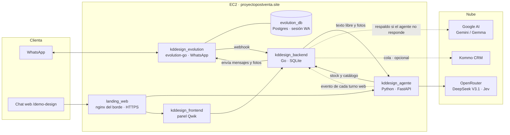
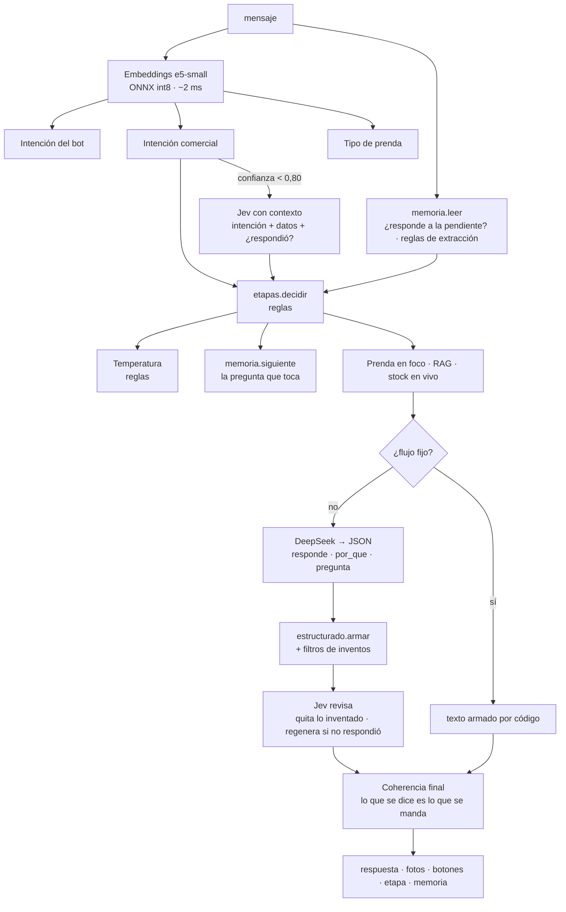
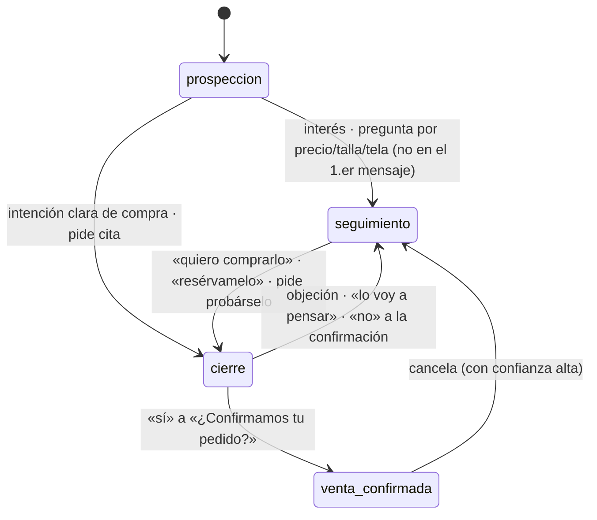

# Arquitectura del asistente de ventas de Baruka Design

Este documento describe cómo está construido el chatbot de ventas de **Baruka Design** (tienda de ropa de mujer
en Perú): qué piezas tiene, cómo viaja un mensaje de la clienta hasta la respuesta, dónde vive el estado de cada
conversación, qué modelos de IA usa y por qué, y cómo se prueba y se despliega.

Es una vista de conjunto. El detalle de cada parte está en:

- [`agente/README.md`](agente/README.md): el agente por dentro, con mediciones.
- [`DEPLOY.md`](DEPLOY.md): despliegue paso a paso.
- [`CLAUDE.md`](CLAUDE.md): contexto, datos reales frente a datos de demostración, trampas conocidas.
- [`AGENTS.md`](AGENTS.md): reglas para quien modifica el código.

Estado descrito: rama `claude/gifted-rubin-oc1iqo`, octubre de 2026.

---

## 1. Qué hace

La clienta escribe por **WhatsApp** o por el **chat web de demostración**. El asistente («Rosmary»):

1. **Indaga la necesidad** antes de mostrar nada: qué busca, para qué ocasión, para cuándo, de día o de noche.
2. Calcula la **temperatura** de la clienta (fría, tibia o caliente) según la urgencia.
3. Ofrece **una sola prenda**, con foto y el porqué, consultando el **stock en vivo**.
4. Responde sobre tela, corte, talla, precio, envíos y showroom con datos reales.
5. **Cierra**: separa la prenda o agenda una **cita para probársela**.
6. Tras el «sí», calcula el **total con envío**, entrega los datos de pago y recibe el **comprobante** por foto.

Todo queda en el **panel** de la tienda (pedidos en kanban, conversaciones, productos y stock) y, cuando se activa, en
**Kommo CRM**.

Este método de venta (indagar → temperatura → una opción → insistir con razones → precio y cita) lo definió el
cliente; el código lo impone (§5).

---

## 2. Vista general



Los dos canales usan **el mismo agente**. WhatsApp pasa por el backend Go, que lleva el flujo del pedido y guarda el
estado. El chat web llama al agente directamente y guarda su estado en el navegador.

---

## 3. Componentes

| Servicio (contenedor) | Tecnología | Responsabilidad | Memoria (límite) |
|---|---|---|---|
| `kddesign_evolution` | [evolution-go](https://github.com/davrv93/evolution-go) (whatsmeow) | Conexión con WhatsApp (QR / emparejamiento), recibir y enviar mensajes; webhook al backend | 160 MB |
| `kddesign_evolution_db` | Postgres 16 | Sesión de WhatsApp | 128 MB |
| `kddesign_backend` | Go, SQLite | API del panel, webhook, **flujo del bot** (`internal/bot`), pedidos, reservas de stock, cola de envío, capa de juicio, sincronización con Kommo | 128 MB |
| `kddesign_agente` | Python 3.12, FastAPI, onnxruntime, scikit-learn | **Inteligencia conversacional**: clasificación, memoria, etapas, RAG, stock, redacción con LLM, búsqueda por foto; sirve además la UI de prueba | 3 GB (usa ~1,1–1,3 GB) |
| `kddesign_frontend` | Qwik estático + nginx | Panel de la tienda en `/baruka/` | 64 MB |
| `landing_web` (proyecto aparte) | nginx | Borde HTTPS: `/baruka/`, `/demo-design/`, `/demo/` y las landings estáticas | — |

**Externos:**

| Servicio | Para qué | Notas |
|---|---|---|
| OpenRouter → **DeepSeek V3.1** (`deepseek-v4-flash` de respaldo) | Redactar las respuestas | De pago. Del orden de US$ 0,001 por mensaje |
| OpenRouter → **Jev 1.13** (TypeSafe) | Clasificar con contexto cuando el local duda; verificar la respuesta antes de enviarla | ~US$ 0,00005 por llamada |
| Google AI → Gemini Flash-Lite / Gemma | Respaldo del backend si el agente no responde; motor alternativo `actual` | Capa gratuita |
| Kommo | CRM: embudo, leads, contactos, notas | Opcional (`KOMMO_ENABLED`) |

---

## 4. Recorrido de un mensaje

### 4.1 WhatsApp

```mermaid
sequenceDiagram
  participant C as Clienta
  participant E as evolution-go
  participant B as Backend Go
  participant A as Agente
  participant L as DeepSeek / Jev
  C->>E: «hola, busco un vestido para una boda»
  E->>B: webhook (mensaje, imagen, ubicación, anuncio)
  B->>B: guarda mensaje · ¿sesión nueva (>6 h)? · ¿bot en pausa?
  alt flujo fijo (menú, código suelto, talla, confirmación, pago)
    B->>B: maneja el paso del pedido
  else texto libre o foto
    B->>A: POST /chat (mensaje, historial, etapa, memoria, perfil, anuncio, pedido en curso)
    A->>A: clasificar · leer memoria · decidir etapa · RAG + stock
    A->>L: redactar (JSON) · revisar (Jev)
    A-->>B: respuesta + fotos + botones + etapa + memoria
    B->>B: guarda etapa y memoria · crea pedido / reserva / cita
  end
  B->>E: envía cada párrafo como un mensaje; luego las fotos; la pregunta final al último
  E->>C: mensajes
  B-->>B: (opcional) evento a la cola de Kommo
```

**Qué resuelve el backend Go sin consultar al agente** (`backend/internal/bot/bot.go`, `step`):

- **Comandos:** `menu`/`0`, números `1`–`4`, y un **código suelto** (`V35`), que arranca el pedido.
- **Estados del pedido:** `esperando_talla` → `esperando_confirmacion` (resumen y **reserva de 10 min**) →
  `esperando_pago` (Lima/provincia, total, datos de pago) → comprobante (foto) → `esperando_ubicacion`.
- Dentro de esos estados, lo que **no** es una talla ni un sí/no («¿hacen envíos a Cusco?», «lo voy a pensar») va al
  agente con el pedido en curso. Si la clienta duda o pide otros modelos, se libera la reserva sin presionar.
- **Asesora:** derivar a una persona **pausa el bot** solo si la clienta lo pide con palabras. `menu` devuelve el bot.
- **Sesión:** tras **6 h de silencio** empieza una conversación nueva. El agente no ve el historial anterior y la
  pausa por asesora caduca.
- **Anuncio:** si el mensaje llega desde un anuncio de clic a WhatsApp (`contextInfo.externalAdReply`), se recuerda
  durante toda la conversación y se pasa al agente.

Si el agente no responde, el backend recurre a Gemini (`internal/ai`).

### 4.2 Chat web (`/demo-design`)

La página (`agente/app/ui.html`) imita una ventana de WhatsApp. Su diseño está en
[`DISENO_WHATSAPP.md`](DISENO_WHATSAPP.md). Llama a `POST /chat` y a `POST /foto` del agente con
el mismo contrato que usa el backend, y guarda `historial`, `etapa` y `memoria` en memoria del navegador.

Los controles de demo están en el menú ⋮:

- **Nuevo chat.**
- **Desde anuncio:** simula la llegada por el anuncio del V42.
- **Motor:** elige el redactor.
- **Análisis:** abre un cajón con etapa, temperatura, memoria, clasificador, Jev y fichas del RAG.

Al final de cada turno, el agente avisa al backend (`POST /api/internal/crm/evento`, con secreto compartido, solo
en la red interna) para que el chat web llegue al CRM por el mismo camino que WhatsApp.

---

## 5. El agente por dentro



**Principio rector:** *los modelos proponen; el código decide*.

- La **etapa** la decide `etapas.py` con reglas.
- La **siguiente pregunta** la elige `memoria.py`.
- El **stock**, los **totales** y los **datos de pago** salen del código y de la base.
- El LLM solo **redacta**, y su texto pasa por filtros y por una verificación antes de salir.

### 5.1 Comprensión (`modelo.py`, `entrenar.py`, `datos.py`)

- **Embeddings:** `Xenova/multilingual-e5-small` cuantizado a int8, servido con fastembed/onnxruntime en CPU. Los
  mensajes llevan el prefijo `query:`; las fichas del catálogo, `passage:`.
- **Clasificadores:** estandarización + regresión logística (scikit-learn), tres cabezas sobre el mismo vector:
  - intención del bot (23 clases);
  - intención comercial (20 clases: `interesado`, `intencion_compra`, `confirmacion_compra`, `objecion`,
    `consulta_precio`…);
  - tipo de prenda.
- **Entrenamiento al construir la imagen:**
  - Datos: los CSV de `agente/data/`, en tríos (correcta, informal y con faltas).
  - Pruebas que no entran al entrenamiento: `prueba_chat.csv` (66) y `prueba_comercial.csv` (68). Las cifras
    salen en el log del build.
- **Comparación con SetFit:** se mide al construir y se usa solo si gana. Hasta hoy no ganó; va apagado con
  `KD_SETFIT_PASOS=0`.
- **Búsqueda por foto** (`imagen.py`): `Qdrant/Unicom-ViT-B-32` con umbrales calibrados («es este» / «se parece»).

### 5.2 Memoria y hilo (`memoria.py`)

Cada conversación lleva una **ficha** que viaja en cada petición. El agente no guarda estado; la guarda quien llama:
el backend en SQLite y la web en el navegador.

```json
{
  "etapa": "seguimiento", "producto": "V35", "mostrados": ["V35"], "pendiente": "talla",
  "sabemos": {"ocasion": "matrimonio", "fecha": "24 de octubre", "fecha_iso": "2026-10-24", "horario": "noche",
              "prenda": "vestido", "talla": null, "ciudad": null, "envio": null, "cita": null, "nombre": "Alvaro"},
  "temperatura": "tibio", "temperatura_motivo": "evento el 24-oct (en 20 días)",
  "preguntado": ["que_busca", "ocasion", "fecha", "horario"], "objeciones": [], "pidio_ver": false
}
```

- **Pregunta pendiente.** Cada pregunta del bot deja anotado qué espera. El siguiente mensaje se lee primero como
  respuesta a esa pregunta. Si no la responde («a ver un momento»), se espera o se repregunta, sin inventar.
- **Repetición.** Las preguntas de indagación se repiten como mucho una vez, con otras palabras. Lo que ya se sabe
  no se vuelve a preguntar, y `quitar_repetidas` borra del texto del LLM las preguntas repetidas.
- **Extracción por reglas.** Se sacan del mensaje: talla, fecha (también relativa: «este sábado», «en dos
  semanas»), estatura, ciudad y envío, ocasión, día/noche, color, presupuesto y nombre. Admite español de chat
  («pa», «matri», «par aboda»). Con Jev activo se suman sus respuestas tipadas, en la misma llamada.
- **Temperatura.** Por la fecha del evento: ≤ 7 días caliente, 8–30 tibia, > 30 fría. Por señales: «solo estoy
  viendo» la enfría; querer comprar, pedir cita o urgencia la calientan. Cambia el tono que se le pide al LLM y el
  orden de las preguntas.
- **Cita.** `validar_cita` rechaza el refrigerio (13–14 h), lo que cae fuera de 9–19 h, el pasado y las fechas
  posteriores al evento, y propone otra hora sin perder el día.

### 5.3 Etapas comerciales (`etapas.py`)



Reglas clave:

- **Interés no es compra.** «Sí, me interesa» lleva a seguimiento, nunca a cierre.
- **El «sí» depende de lo último que preguntó el bot.** Solo vale como confirmación en cierre.
- **El primer mensaje se queda en prospección**, salvo compra explícita.
- **Mientras se indaga la necesidad** no se sale de prospección ni se muestran prendas.
- **Umbrales de confianza:** ≥ 0,80 se usa tal cual; entre 0,60 y 0,80 solo se dan pasos prudentes; < 0,60 la
  etapa no cambia.

### 5.4 Producto, RAG y stock (`main.py`, `stock.py`)

- **RAG:** fichas del catálogo vivo, que se leen del backend cada 5 min (`/api/public/catalog`). Solo contienen lo
  semiestático: nombre, color, precio, descripción y material.
- **Stock como herramienta, no como conocimiento.** Se consulta en el momento a `/api/public/stock`:
  disponible = físico − reservas vigentes. El LLM solo puede afirmar las tallas de la línea `AHORA:`.
- **Prenda en foco:**
  1. la nombrada (por código o por nombre propio: «el Irla»);
  2. la del pedido en curso;
  3. la de la memoria;
  4. la del anuncio, solo si llegó por un anuncio (`PRODUCTO_DEMO`).
  Sin nada de eso, a «¿tienen este vestido?» el bot pregunta cuál es (foto o nombre).
- **Una sola opción** (`mejor_opcion`): la mejor con stock para la necesidad (ocasión, horario, color,
  presupuesto). Se muestran varias solo si la clienta lo pide.
- **Reranker** cross-encoder (`rerank.py`): escrito, apagado (`RERANK=0`).

### 5.5 Redacción y control de calidad

1. **Prompt comercial** (`_prompt_comercial`, `venta.py`). Incluye:
   - rol y reglas;
   - la guía de la etapa, según la temperatura;
   - **lo que ya sabemos**, **lo que estás esperando** y **la siguiente pregunta**;
   - datos de la tienda (`seed/tienda.md`, `seed/venta.json`);
   - fichas con la línea de stock y totales **ya calculados**;
   - historial.
2. **Respuesta estructurada** (`estructurado.py`). DeepSeek devuelve
   `{"responde": …, "por_que": …, "pregunta": …}` y el código arma el mensaje:
   - primero lo que contesta (máx. 2 frases);
   - después por qué le conviene (máx. 1);
   - al final la pregunta elegida por el código.
   Se quitan las preguntas metidas en otros campos.
3. **Filtros** (`_sin_inventos`, `_sin_escasez`, `_sin_pies`…). Quitan plazos de entrega, descuentos, precios o
   telas que no figuran, escasez inventada, pies de foto copiados y saludos repetidos.
4. **Revisión con Jev** (`jev.revisar`), en una sola llamada:
   - quita los párrafos que afirman algo de la prenda que su ficha no dice;
   - pregunta si la respuesta contesta lo que la clienta preguntó; si no, **regenera una vez**.
5. **Coherencia final:**
   - Si el texto nombra una prenda, la foto es de esa prenda.
   - Sin pedir varias, sale como mucho una foto.
   - Una foto o unos datos prometidos se mandan en el mismo turno.
   - Con foto, la pregunta final va después de la foto.
6. **Respaldo sin LLM** (`respaldo_codigo`). Si DeepSeek no responde, por ejemplo por falta de saldo, el código
   arma el mensaje: prenda, precio, tallas de ahora, tela, showroom, envíos y la pregunta que toca.

**Flujos fijos, sin LLM:** «¿cuál vestido?», «aquí te espero», resumen del pedido, total con envío + datos de pago +
pedido de comprobante, y la cita (pedir día y hora, validar, confirmar con dirección).

---

## 6. Estado y datos

### 6.1 Base de datos del backend (SQLite, volumen `kddesign_backend_data`)

| Tabla | Contenido |
|---|---|
| `customers`, `conversations`, `messages` | Clientas, conversaciones (con `state` del flujo y `context` JSON: etapa, memoria, anuncio, inicio de sesión) y mensajes |
| `products`, `product_variants`, `warehouses`, `warehouse_stock` | Catálogo, tallas y stock (las sucursales están desactivadas en Baruka) |
| `orders`, `order_items`, `stock_reservations` | Pedidos (consulta → pendiente → confirmado → …) y reservas con caducidad de 10 min |
| `decisiones`, `followups`, `pares_dpo` | Capa de juicio (en sombra), seguimientos y pares para alineación futura |
| `kommo_vinculos` | Conversación ↔ lead/contacto de Kommo |
| `settings` | Ajustes del panel (bot activo, pausa al responder a mano…) |

Las fotos de productos y las que manda la clienta están en el mismo volumen (`/media`).

### 6.2 Datos del agente

| Ruta | Qué es | ¿En git? |
|---|---|---|
| `agente/data/*.csv` | Entrenamiento y pruebas del clasificador | Sí |
| `agente/data/regresion_*` | Las 60 preguntas y 30 conversaciones de la prueba de regresión | Sí (no re-entrenan la imagen) |
| `agente/seed/tienda.md`, `venta.json` | Showroom, horarios, envíos (Lima S/ 15, provincia S/ 20), asesora | Sí |
| `agente/seed/producto_demo.json` | Material y lámina del vestido del anuncio (V42) | Sí |
| `agente/seed/estilo.jsonl` | Banco de estilo para el prompt (apagado, `ESTILO_FEWSHOT=0`) | Sí |
| `agente/seed/pago.md` | **Datos de pago reales** | **No** (repo público; viaja por rsync) |
| `agente/index/` | Modelos y clasificadores entrenados en el build | No |

---

## 7. Integración con Kommo CRM (opcional)

Un solo camino para los dos canales. Al final de cada turno sale **un evento** con el estado completo. Una **cola**
con un trabajador en segundo plano lo aplica a Kommo a 6 peticiones/s, con reintentos ante 429 y 5xx. Si Kommo cae
o va lento, la clienta no lo nota.

| En el bot | En Kommo (embudo «Baruka · Ventas por WhatsApp») |
|---|---|
| prospección / seguimiento / cierre | Prospección / Seguimiento / Cierre |
| venta confirmada | Venta confirmada (no retrocede sola) |
| comprobante recibido o pedido en preparación/envío/entregado | Venta pagada (ganado) |
| cancelación después de confirmar | Venta perdida |

- **Registros:** un contacto por clienta y un lead por conversación.
- **Campos (13):** temperatura, ocasión, fecha del evento, día/noche, talla, prenda en foco, ciudad/envío, cita,
  canal, anuncio, pedido, enlace a la conversación e ID interno.
- **Etiquetas:** canal, temperatura, anuncio.
- **Notas:** una por hito.
- **Herramientas:** `kommo-seed` crea el embudo y los campos, carga 24 leads de demostración y vuelca las
  conversaciones existentes.
- **Activación:** con `KOMMO_ENABLED=1` y token de una integración privada. Detalle en `DEPLOY.md` §11.

---

## 8. Despliegue

- **Servidor:** EC2 `3.132.249.89` (2 vCPU, ~7,8 GB RAM, sin GPU), proyecto Compose `kddesign`, dominio
  `proyectopostventa.site` con certificado de Let's Encrypt.
- **Rutas del borde:**
  - `/baruka/`: panel.
  - `/baruka/api/…`: API.
  - `/demo-design/`: chat web y API del agente.
  - `/demo/`: página de demostración.
  - `/`: landing de la consultora.
- **Procedimiento** (`DEPLOY.md`):
  1. validar en local;
  2. respaldar el volumen y la sesión de WhatsApp;
  3. rsync del árbol (sin `.git`, `.env` ni el override);
  4. construir **un servicio a la vez**;
  5. revisar en el log del build las cifras del clasificador, la búsqueda por foto y las pruebas;
  6. verificar las rutas y el `/health`.
- **Tiempos de build:**
  - El agente se re-entrena solo si cambian `data/`, `datos.py`, `modelo.py` o `entrenar.py` (~1 min con SetFit
    apagado).
  - Si solo cambia `main.py`, el build tarda segundos.
- **Interruptores principales** (en `.env` del servidor → `docker-compose.yml`):

| Variable | Producción | Efecto |
|---|---|---|
| `MOTOR` | `deepseek` | Redactor del agente |
| `KD_JEV_MODO` / `KD_JEV_VERIFICAR` | `cascada` / `1` | Jev clasifica cuando el local duda y verifica cada respuesta |
| `KD_PRODUCTO_DEMO` | `V42` | Vestido del anuncio (solo para quien llega por anuncio) |
| `KD_SUCURSALES` | `0` | Sin sucursales: un showroom con cita |
| `KD_SETFIT_PASOS` / `KD_CLASIFICADOR` | `0` / `auto` | SetFit apagado |
| `JUICIO_MODO` | `sombra` | La capa de juicio registra sin actuar |
| `KOMMO_ENABLED` | `0` | CRM apagado hasta tener credenciales |
| `RESPUESTA_LLM_PRUEBA` | sin definir | Solo para la prueba de regresión; nunca en producción |

---

## 9. Calidad: cómo se prueba

| Prueba | Dónde | Qué cubre | Costo |
|---|---|---|---|
| `prueba_etapas` (50), `prueba_memoria` (313), `prueba_estructurado` (13) | En cada build del agente; si falla, no hay imagen | Máquina de etapas, extracción, hilo, siguiente pregunta, temperatura, cita, armado de la respuesta | 0 |
| `prueba_animo`, `prueba_crm`, `prueba_estilo` | A mano / build | Ánimo y urgencia, aviso al CRM, banco de estilo | 0 |
| Clasificador | Log del build | Intención 98,5 % (65/66) y comercial 98,5 % (67/68) en conjuntos independientes; foto top1 0,976 | 0 |
| `go test ./...` | Backend | Flujo del bot de punta a punta con agente y Evolution simulados, reservas, pagos, sesión, Kommo simulado, Kommo caído | 0 |
| **Regresión** (`python -m app.regresion`) | Antes de cada deploy | 60 preguntas + 30 conversaciones (incluidas reales anonimizadas) con afirmaciones por turno, 47 entradas raras (nunca 500) y carga de 20 chats en paralelo | 0 (sin LLM) |
| `conversaciones.py` | Puntual | 200 conversaciones (50 reservadas), con clienta simulada y juez | Usa LLM |
| `evaluar_jev.py` | Puntual | Exactitud y calibración de Jev, cascada, verificación | Centavos |

Última corrida de regresión antes de desplegar: 60/60, 30/30, 47/47; carga de 200 peticiones sin errores, p95
0,8 s. En producción, la latencia por mensaje con LLM está entre 1,1 y 2,8 s.

---

## 10. Seguridad y privacidad

- **Secretos:** las claves (OpenRouter, Gemini, Kommo, Evolution, JWT, webhook) están solo en el `.env` del
  servidor. No se imprimen; se comprueban con un booleano. `pago.md` está fuera de git.
- **Webhook y ruta del CRM:**
  - El webhook de Evolution exige un secreto en la ruta.
  - La ruta interna del CRM exige un secreto propio y rechaza lo que llega por el proxy; el nginx del panel
    devuelve 404 a `/api/internal/`.
- **Qué sale del servidor:**
  - A DeepSeek y a Jev (vía OpenRouter): el texto de la conversación, **sin el nombre de la clienta** en el caso
    de Jev.
  - A Kommo: los datos de la venta. Las transcripciones son opcionales y van con los números largos tapados.
- **Datos de prueba:** las conversaciones reales usadas en las pruebas están anonimizadas. El volcado crudo no se
  guarda.

---

## 11. Decisiones de diseño (y por qué)

| Decisión | Motivo / evidencia |
|---|---|
| **Reglas deciden la etapa; el LLM solo redacta** | El cliente dictó un proceso (prospección → seguimiento → cierre) que debe poder auditarse. Antes, el LLM cerraba prematuramente («¿confirmamos tu pedido?» al decir la talla). |
| **Memoria explícita en vez de releer el historial** | Sin ella el bot inventaba la prenda («el que mencionaste»), repetía preguntas y mandaba fotos al azar. |
| **Respuesta estructurada + filtros + Jev** | En 50 conversaciones reservadas, lo que fallaba era la redacción (hilo, tono, no contestar), no la clasificación. |
| **e5-small cuantizado en vez de jina** | Misma exactitud, 500 MB frente a 897 y 2 ms frente a 13 por mensaje. |
| **SetFit apagado** | Se midió: 97,0 / 95,6 % frente a 98,5 / 97,1 % del modelo sin ajustar, y +300 MB de RAM. |
| **LLM por API y no local** | Un modelo de 1,5–4 B en la CPU del EC2 tardaría 1–3 min por mensaje. El Qwen 1,5 B afinado con LoRA contestó lo preguntado en el 45 % de los turnos. Una GPU cuesta ~US$ 384/mes; la API, centavos. |
| **Un solo agente para web y WhatsApp** | Mismo comportamiento en los dos canales y una sola cosa que probar. |
| **Stock como herramienta** | Un índice de hace cinco minutos no puede afirmar «sí, hay en M». |

---

## 12. Limitaciones conocidas

- Si se agota el saldo de OpenRouter, DeepSeek y Jev dejan de responder y el bot pasa al respaldo por código. Sigue
  funcionando, con menos naturalidad.
- El tono, «insistir con razones» y las preguntas abiertas («¿combina con zapatos dorados?») dependen del LLM.
- El clasificador comercial duda (confianza < 0,60) en una parte de los mensajes dentro de conversaciones. El
  sistema lo amortigua (memoria, Jev, umbrales), pero conviene medir cuánto afecta la etiqueta dudosa que se imprime
  en el prompt.
- No hay respaldo automático de los volúmenes; el respaldo es manual (`DEPLOY.md` §7).
- La API de Kommo no permite borrar leads; los de demostración se cierran y se borran a mano.

---

## 13. Mapa del código

```
agente/
  app/main.py            API (/chat, /foto, /clasificar, /health…) y orquestación de cada turno
  app/memoria.py         ficha de la conversación, pendiente, extracción, siguiente pregunta, temperatura, cita
  app/etapas.py          máquina de estados comercial
  app/venta.py           prompt de sistema, guía por etapa, totales, pago, banco de estilo
  app/estructurado.py    respuesta en JSON → mensaje armado por código
  app/jev.py             Jev: clasificación con contexto, verificación, sombra
  app/stock.py           stock en vivo (herramienta)
  app/modelo.py          embeddings y clasificadores;  entrenar.py · datos.py · setfit.py
  app/imagen.py          búsqueda por foto
  app/crm.py             aviso al backend al final de cada turno web
  app/regresion.py       prueba de regresión;  conversaciones.py · evaluar_jev.py · gasto.py
  app/ui.html            chat web estilo WhatsApp
  data/  seed/  imagenes/  Dockerfile
backend/
  cmd/server             servidor HTTP
  cmd/kommo-seed         embudo, campos, datos demo y volcado a Kommo
  internal/bot           flujo de WhatsApp: estados del pedido, sesión, asesora, pago, comprobante, memoria, cita, CRM
  internal/agente        cliente HTTP del agente
  internal/kommo         cliente, esquema y sincronizador de Kommo
  internal/juicio        capa de juicio (sombra)
  internal/store         SQLite: modelos y migraciones
  internal/api           API del panel, webhook, ruta interna del CRM
  internal/evolution     cliente de evolution-go
  internal/ai            respaldo con Gemini/Gemma
frontend/                panel Qwik (/baruka/): pedidos, conversaciones, productos, WhatsApp, ajustes
docker-compose.yml       servicios, límites de memoria e interruptores
```
