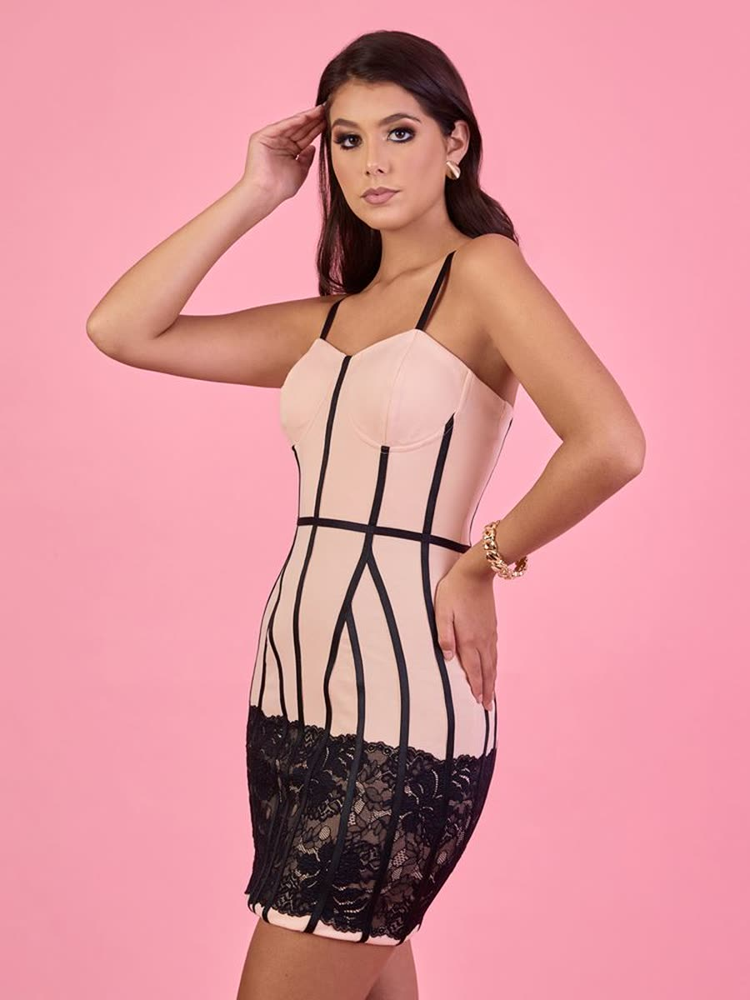

# Baruka Design — landing editorial

Página única, estática y autónoma para Baruka Design: se abre con doble clic en
`index.html` (no necesita build ni servidor). Las fuentes, GSAP, ScrollTrigger y
Lenis se cargan desde CDN, así que necesita conexión a internet.

## Cómo verla

- Doble clic en `index.html`, o
- servidor local: `python3 -m http.server 8000` y abrir `http://localhost:8000`.

## Estructura

```
index.html          Todo el contenido y las fotos (una sección por bloque).
styles.css          Tokens (un color y un tamaño por variable) + layout.
js/core.js          Estado, utilidades, Lenis + ScrollTrigger, marcador de fotos.
js/intro.js         Encendido CRT (1,8 s, saltable, se recuerda en sessionStorage).
js/hero.js          Pin 200 vh: las letras se separan y aparece la foto.
js/morph.js         Pin 400 vh: 4 looks, shader de desplazamiento o fundido.
js/leaves.js        Hojas azules en caída (Canvas 2D, dos capas de profundidad).
js/gallery.js       Galería: scroll vertical -> horizontal (escritorio).
js/editorial.js     Cita, parallax inverso y contadores.
js/closing.js       "Encuéntranos" con relleno por scroll.
js/main.js          Arranque.
img/                Fotos de marcador 3:4 (900x1200).
tools/gen-placeholders.sh   Regenera los marcadores (ffmpeg).
```

## Dónde reemplazar fotos

Todas son **3:4 (900x1200)**. Sustituye el archivo por la foto real con el
**mismo nombre**; no hay que tocar el código.

| Archivo | Dónde se usa |
|---|---|
| `img/hero.jpg` | Foto de fondo del hero (campaña). |
| `img/kendall.jpg`, `img/begonia.jpg`, `img/xela.jpg`, `img/azra.jpg` | Los 4 looks del morfo. |
| `img/editorial-1.jpg`, `img/editorial-2.jpg` | Fotos superpuestas del editorial. |
| `img/<prenda>.jpg` | Foto principal de cada tarjeta de la galería. |
| `img/<prenda>_alt.jpg` | Segunda foto (hover / tap) de esa tarjeta. |

Prendas de la galería: `kendall, codman, anika, kabanova, cristal, ankara, azra,
elvi, pandora, xela, begonia, paola, holly`.

Si una foto falta, el sitio muestra un marcador generado al vuelo con el texto
alternativo. Para regenerar los marcadores de demostración:
`./tools/gen-placeholders.sh` (requiere `ffmpeg`).

### Rendimiento (AVIF/WebP)

Hoy se usa ``. Para
servir formatos modernos, convierte cada foto y envuelve la etiqueta:

```html
<picture>
  <source type="image/avif" srcset="img/kendall.avif">
  <source type="image/webp" srcset="img/kendall.webp">
  
</picture>
```

Las dimensiones fijas evitan saltos de layout (CLS ≈ 0).

## Dónde cambiar textos

- **Contenido y secciones:** `index.html` (hero, morfo, galería, editorial,
  cierre, pie).
- **Looks del morfo** (nombre, precio y color de fondo de cada transición):
  `LOOKS` en `js/morph.js`. El HTML del morfo solo lleva la lista de etiquetas.
- **Contacto:** en `js/core.js`, `Baruka.config`:
  - `whatsapp`: solo dígitos, con código de país (hoy `51999999999`, placeholder).
  - `whatsappText`: mensaje precargado.
  - `catalogUrl`: enlace "Ver catálogo".
- **Redes del pie:** enlaces en `index.html` (sección `.site-foot`).

## Estilos y accesibilidad

- Los colores y tamaños viven en `:root` de `styles.css` (marfil, tinta,
  cobalto, hielo; tamaños `--fs-*`). No hay colores sueltos en el JSX/HTML.
- `prefers-reduced-motion`: sin encendido CRT, sin partículas; el hero, el morfo
  y el cierre quedan estáticos y legibles.
- El intro está marcado `aria-hidden` y se salta con clic o tecla; los textos
  llevan `alt` descriptivo y el foco es visible.

## Notas

- Si se embebe bajo un alias (p. ej. `/baruka/landing/`), las rutas `img/…` son
  relativas y siguen funcionando; los CDN son absolutos.
- Esta carpeta no está conectada al despliegue del CRM (`docker-compose.yml`).
  Para publicarla, súbela como está a un nginx o a un bucket estático.
